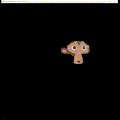

# Instruções de Compilação

1. **Clone o Repositório**
   ```sh
   git clone <link_do_repositorio>
   cd <nome_do_repositorio>
   ```

2. **Setup do Projeto**
   👉 [Getting Started - CGCCHibrido](https://github.com/fellowsheep/CGCCHibrido/blob/main/GettingStarted.md)

3. **Execute o Executável**
   ```sh
   ./OpenGLDemo
   ```

# Comandos do Teclado

## Seleção de entidade
- C: Seleciona a próxima entidade.

## Rotação da entidade selecionada
- X: Liga/desliga rotação no eixo X.
- Y: Liga/desliga rotação no eixo Y.
- Z: Liga/desliga rotação no eixo Z.

## Escala da entidade selecionada
- O: Diminui a escala (mínimo 0.1).
- I: Aumenta a escala (máximo 1.0).

## Translação da entidade selecionada
- U: Move para a esquerda no eixo X.
- J: Move para a direita no eixo X.

## Movimento da Câmera
- A: Move para cima no eixo Y.
- D: Move para baixo no eixo Y.
- W: Move para frente no eixo Z.
- S: Move para trás no eixo Z.
- Mouse:
    - Movimento do mouse para a esquerda/direita: rotaciona a câmera horizontalmente.
    - Movimento do mouse para cima/baixo: rotaciona a câmera verticalmente.


## Resultado

