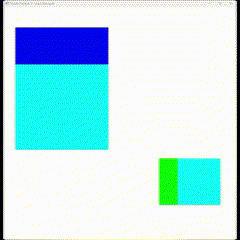

# Comandos do Teclado

## Seleção do cubo
- C: Muda de entidade

## Rotação do cubo selecionado
- X: Liga/desliga rotação no eixo X.
- Y: Liga/desliga rotação no eixo Y.
- Z: Liga/desliga rotação no eixo Z.

## Escala do cubo selecionado
- [ (Colchete Esquerdo): Diminui a escala.
- ] (Colchete Direito): Aumenta a escala.

## Translação do cubo selecionado
- A: Move para cima no eixo Y.
- D: Move para baixo no eixo Y.
- W: Move para frente no eixo Z.
- S: Move para trás no eixo Z.
- I: Move para a esquerda no eixo X.
- J: Move para a direita no eixo X.

## Resultado

