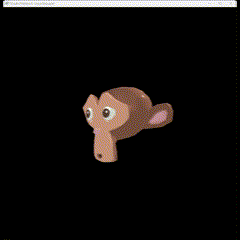

# Comandos do Teclado

## Rotação da entidade selecionada
- X: Liga/desliga rotação no eixo X.
- Y: Liga/desliga rotação no eixo Y.
- Z: Liga/desliga rotação no eixo Z.

## Escala da entidade selecionada
- O: Diminui a escala (mínimo 0.1).
- I: Aumenta a escala (máximo 0.8).

## Translação da entidade selecionada
- A: Move para cima no eixo Y.
- D: Move para baixo no eixo Y.
- W: Move para frente no eixo Z.
- S: Move para trás no eixo Z.
- U: Move para a esquerda no eixo X.
- J: Move para a direita no eixo X.

## Resultado
